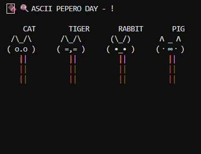

### ASCII Pepero Day — Console Animation

> 
> self-celebrating `pepero-day` with type-script practice
>
> watch ascii animals eat pepero in your console
>
> eating animation is simply implemented:
> each frame shortens the pepro-stick to create a behavior of 'eating' sequence
> rendered with ansi-escape codes.
> [wiki-podia](https://en.wikipedia.org/wiki/ANSI_escape_code)

---

### Run Locally

> Prerequisites:
> - Node.js (v20 or higher)
> - npm

```bash
# 1. Install dependencies
npm install

# 2. Build TypeScript
npm run build

# 3. Run the animation
npm start
```

> To run directly without build
```bash
npx ts-node src/main.ts
```

---

### Add Your Own Animal
> To add a new animal
1. Open `src/models/face.ts`
2. Create a new Animal Face
```typescript
const DRAGON: Animal = {
  name: "DRAGON",
  face: {
    ears: "  /\\ ",
    eyes: "( @_@ )",
  },
};
```
3. Add to export list
```typescript

export const ANIMALS: Animal[] = [CAT, TIGER, RABBIT, PIG, DRAGON]; // dragon added
```